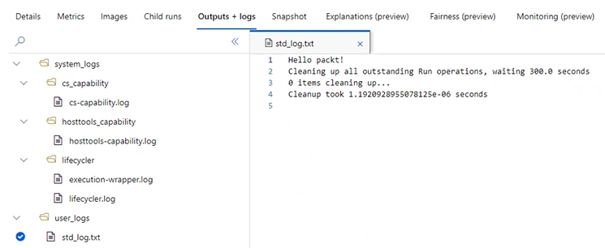

# Updates and additional topics

This file contains various updates to the book and additional help requested over github issues.

## Clone this repository within your Azure Machine Learning workspace

To clone the code in your workspace, open a terminal and use the following command:

``` bash
git clone https://github.com/PacktPublishing/Microsoft-Certified-Azure-Data-Scientist-Associate-Certification-Guide.git book
```

This command will clone this repository into the `book` folder. If you refresh the **Files** tree, you should be able to see the new folder.


To pull the latest version of the codebase, you will first need to revert any changes made to your working copy and then pull the new version. You can do that using the following code:

``` bash
git checkout .
git pull
```

The following image shows what will happen if you have changes in your working copy that conflict with the changes on the remote GitHub server. This image also shows how to revert all local changes and then pull the latest version from the remote GitHub server.


## February 2022 updates on the book

- On page 213 the text mentions the `upload() method` when it is actually `upload_files() method`. Moreover, both `upload()` and `upload_files()` methods [are deprecated from the SDK](https://docs.microsoft.com/python/api/azureml-core/azureml.data.azure_storage_datastore.azureblobdatastore?view=azure-ml-py#azureml-data-azure-storage-datastore-azureblobdatastore-upload-files) and may be removed in the future. If the code snippet doesn’t work for you, you can upload the files through the Azure portal or use the [`Dataset.File.upload_directory()`](https://docs.microsoft.com/python/api/azureml-core/azureml.data.dataset_factory.filedatasetfactory?view=azure-ml-py#azureml-data-dataset-factory-filedatasetfactory-upload-directory) method instead.
- On page 284, the quotes did not print correctly. The proper code snippet is the following:

  ```python
  from azureml.core import Workspace, Environment
  from azureml.core.conda_dependencies import CondaDependencies 
  import sklearn
  
  ws = Workspace.from_config()
  diabetes_env = Environment(name="diabetes-training-env")
  diabetes_env.python.conda_dependencies = CondaDependencies.create(
   conda_packages=[f"scikit-learn=={sklearn.__version__}"],
   pip_packages=["azureml-core", "azureml-dataset-runtime[pandas]"])
  target = ws.compute_targets['cpu-sm-cluster']
  ```

- On page 293, the quotes did not print correctly. Moreover, the `AzureML-Minimal` environment is only accessible through the `Environment.get(ws, "AzureML-Minimal")` reference and not the `ws.environments["AzureML-Minimal"]` notation that was used earlier in the book. The proper code snippet is the following:

  ```python
  from azureml.core import Workspace, ScriptRunConfig, Environment

  ws = Workspace.from_config()
  target = ws.compute_targets["cpu-sm-cluster"]

  script = ScriptRunConfig(
      source_directory="termination-policy-training",
      script="training.py",
      environment=Environment.get(ws, "AzureML-Minimal"),
      compute_target=target,
  )
  ```

- On page 347, the `AzureML-Tutorial` environment is only accessible through the `Environment.get(ws, "AzureML-Tutorial")` reference and not the `ws.environments["AzureML-Tutorial"]` notation that was used earlier in the book. The proper code snippet is the following:

  ```python
  from azureml.core import RunConfiguration, Environment

  runconfig = RunConfiguration()
  runconfig.environment = Environment.get(ws, 'AzureML-Tutorial')
  ```

## April 2022 updates on the book

- On pages 235 and 242 [`start_logging` method](https://docs.microsoft.com/en-us/python/api/azureml-core/azureml.core.experiment.experiment?view=azure-ml-py#azureml-core-experiment-experiment-start-logging) requires the mandatory `snapshot_directory=None` argument. This means that the following code

  ```python
  run = exp.start_logging()
  print(run.get_details())
  ```

  needs to change to the following:

  ```python
  run = exp.start_logging(snapshot_directory=None, display_name="Run in notebook")
  print(run.get_details())
  ```

- On page 250, the logs structure has changed. The `70_driver_log.txt` log file is replaced by the `std_log.txt` which is located under the `user_logs`.

  

- On page 251, you are asked to add a `.amlignore` file. This file is automatically generated by the platform and you will be prompted to replace the file.

- On page 266, make sure you copy the code properly or download it from this repository. 
  - If you get an error message `NameError: name 'model' is not defined` while executing the script, make sure you don't have any leading space in the line that reads `model, nrmse = train_and_evaluate...`.
  - If you get an error message `TypeError: unsupported operand type(s) for +: 'NoneType' and 'float'`, this means that you haven't specified a value for the alpha parameter. To fix that you need to either invoke the script passing the alpha parameter `python training.py --alpha 0.001` or set a default value on the `add_argument` definition like the following:

    ```python
    parser.add_argument('--alpha', type=float,
                        dest='alpha', help='The alpha parameter',
                        default= 0.001)
    ```

- On pages 255, 269, 390, 404 and 409 the code has wrong casing for the package `.Python.`. The correct way is lowercase `.python.`. E.g.:
  - instead of `minimal_env.Python.conda_dependencies` you should write `minimal_env.python.conda_dependencies`
  - instead of `diabetes_env.Python.conda_dependencies` you should write `diabetes_env.python.conda_dependencies`
  - instead of `myEnv.Python.conda_dependencies` you should write `myEnv.python.conda_dependencies`
  - instead of `pEnv.Python.conda_dependencies` you should write `pEnv.python.conda_dependencies`

- On page 290, we can replace the first sentence to "In the Files view, add a new folder named termination-policy-training and add a new training.py
file to it, as shown in Figure 9.7" to clearly specify that the `training.py` file is a new one and not a copy of the previous file.

## May 2022 updates on the book

- Replace `azureml-defaults` pip package with `azureml-core`. Replace `azureml-dataprep` pip package with `azureml-dataset-runtime`. If you are using the old packages, environment building may time out while fetching packages from pip.
